# Branch Workflow and PR Strategy

This document explains the branch strategy and automated PR workflows for the OpenToken repository.

## Branch Structure

```
main (stable, production-ready)
  ↑
  | (only from release/* branches)
  |
release/x.y.z (version bump, final testing)
  ↑
  | (merge when ready for release)
  |
develop (integration, tested features)
  ↑
  | (all feature/bug PRs go here)
  |
feature/*, bugfix/*, etc. (development work)
```

## Workflow Diagrams

### Standard Feature Development Flow


### Release Process Flow

```mermaid
graph TB
    A[develop ready for release] --> B[Create release/x.y.z branch]
    B --> C[Run bump2version]
    C --> D[Open PR to main]
    D --> E{validate-pr-target check}
    E -->|✅ Pass: from release/*| F{All CI checks pass?}
    E -->|❌ Fail: not from release/*| G[PR blocked]
    F -->|Yes| H[Code Review & Merge]
    F -->|No| I[Fix Issues]
    I --> D
    H --> J[Tag release on main]
    J --> K[Merge main back to develop]
    K --> L[Delete release branch]
```



### PR Auto-Retargeting Flow

```mermaid
graph TB
    A[Developer opens PR to main] --> B{From release/* branch?}
    B -->|Yes| C[✅ validate-pr-target passes]
    B -->|No| D[🤖 Auto-retarget to develop]
    D --> E[Comment posted explaining change]
    E --> F[PR now targets develop]
    C --> G[PR proceeds to merge process]
```



## Automated Workflows

### 1. Retarget PR to Pre-Release (`retarget-pr-to-develop.yml`)

**Trigger**: When a PR is opened/reopened/edited targeting `main`

**Behavior**:
- ✅ **IF** PR is from a `release/*` branch → No action (allow it)
- 🤖 **ELSE** → Automatically change base branch to `develop` and post comment

**Purpose**: Prevent accidental merges to `main` from feature branches

### 2. Validate PR Target (`validate-pr-target.yml`)

**Trigger**: When a PR targets `main`

**Behavior**:
- ✅ **IF** PR is from a `release/*` branch → Check passes (green)
- ❌ **ELSE** → Check fails (red) with explanation

**Purpose**: Enforce that only release PRs can merge to `main` (via branch protection)

## Branch Descriptions

### `main`
- **Purpose**: Production-ready, stable releases
- **Protection**: 
  - Required status check: `validate-pr-target`
  - All CI checks must pass
  - Only accepts PRs from `release/*` branches
- **Merges from**: `release/*` branches only
- **Merges to**: `develop` (to sync after release)

### `develop`
- **Purpose**: Integration branch for tested features
- **Protection** (recommended):
  - All CI checks must pass
  - Code review required
- **Merges from**: `feature/*`, `bugfix/*`, `hotfix/*`, etc.
- **Merges to**: `release/*` branches (for release preparation)

### `release/*`
- **Purpose**: Final preparation for production release
- **Naming**: `release/x.y.z` (semantic versioning)
- **Lifecycle**:
  1. Branch from `develop`
  2. Run `bump2version` to update version
  3. Final testing and bug fixes
  4. Open PR to `main`
  5. After merge, delete branch
- **Merges from**: `develop`
- **Merges to**: `main` only

### `feature/*`, `bugfix/*`, etc.
- **Purpose**: Development work
- **Lifecycle**:
  1. Branch from `develop`
  2. Develop and test locally
  3. Open PR to `develop`
  4. After merge, delete branch
- **Merges from**: `develop`
- **Merges to**: `develop`

## Examples

### Example 1: Adding a New Feature

```bash
# Start from develop
git checkout develop
git pull origin develop

# Create feature branch
git checkout -b feature/new-token-type

# Make changes, commit
git add .
git commit -m "Add new token type T6"

# Push and open PR to develop
git push origin feature/new-token-type
# Open PR on GitHub: feature/new-token-type → develop
```

### Example 2: Making a Release

```bash
# Ensure develop is up to date
git checkout develop
git pull origin develop

# Create release branch
git checkout -b release/1.5.0

# Update version
bump2version minor  # or major/patch

# Push release branch
git push origin release/1.5.0

# Open PR on GitHub: release/1.5.0 → main
# After merge and tagging:
git checkout main
git pull
git tag v1.5.0
git push origin v1.5.0

# Sync main back to develop
git checkout develop
git merge main
git push origin develop

# Clean up release branch
git push origin --delete release/1.5.0
git branch -d release/1.5.0
```

### Example 3: Accidental PR to Main

```bash
# Developer mistakenly opens PR: feature/my-work → main
# 🤖 GitHub Actions automatically:
#    1. Changes base to: feature/my-work → develop
#    2. Posts comment explaining the change
# ✅ Developer continues with the PR to develop
```

## FAQ

**Q: Why can't I open a PR to `main` from my feature branch?**  
A: Feature work should go to `develop` first. Only release branches can merge to `main`. This ensures `main` is always stable and production-ready.

**Q: My PR was auto-retargeted. Is this normal?**  
A: Yes! If you opened a PR to `main` from a non-release branch, it's automatically retargeted to `develop`. This is by design.

**Q: How do I make a hotfix?**  
A: Hotfixes follow the same process as releases:
1. Create a `release/x.y.z` branch from `develop` (or `main` if urgent)
2. Apply the fix and bump version
3. Open PR to `main`
4. After merge, sync back to `develop`

**Q: What if I need to merge to `main` for an emergency?**  
A: Create a `release/hotfix-x.y.z` branch. The branch name must start with `release/` to pass validation.

**Q: Can I bypass the branch protection?**  
A: Repository admins can override branch protection, but it's strongly discouraged. Follow the release process to maintain code quality and stability.

## Related Documentation

- [Branch Protection Setup Guide](BRANCH_PROTECTION_SETUP.md) - Admin setup instructions
- [Pull Request Template](pull_request_template.md) - Contributor guidance
- Workflow files:
  - [retarget-pr-to-develop.yml](workflows/retarget-pr-to-develop.yml)
  - [validate-pr-target.yml](workflows/validate-pr-target.yml)
