# Branch Workflow and Release Process

This document explains the **Gitflow-based** branch strategy and automated workflows for the OpenToken repository.

We follow Gitflow's separation of `main`, `develop`, `dev/*`, and `release/*` branches, with a few automation-oriented tweaks (notably an automated `main` → `develop` sync after each release).

## Branch Structure

```
dev/* (development work)
  ↓
  | (all feature/bug PRs go here)
  |
develop (integration, tested features)
  ↓
  | (merge when ready for release)
  |
release/x.y.z (version bump, final testing)
  ↓
  | (only from release/* branches)
  |
main (stable, production-ready)
```

## Workflow Diagrams

### Standard Feature Development Flow


### Release Process Flow (Automated)

```mermaid
graph TB
    A[develop ready for release] --> B[Create release/x.y.z branch]
    B --> C[Push to origin]
    C --> D[Open PR to main]
    D --> E["🤖 auto-version-bump workflow runs"]
    E --> F["Updates all version files<br/>Commits to release branch"]
    F --> G{All CI checks pass?}
    G -->|No| H[Fix Issues]
    H --> D
    G -->|Yes| I[Code Review & Merge to main]
    I --> J["🤖 auto-release workflow runs"]
    J --> K["Creates git tag vx.y.z<br/>Creates GitHub release<br/>Creates sync PR: main → develop"]
    K --> L[Release Published]
```



### PR Auto-Retargeting Flow

```mermaid
graph TB
    A[Developer opens PR to main] --> B{From release/* branch?}
    B -->|Yes| C[✅ PR allowed to proceed]
    B -->|No| D[PR auto-retargeted to develop]
    D --> E[Comment posted explaining change]
    E --> F[Developer continues with develop PR]
```



## Branch Descriptions

### `main`

- **Purpose**: Production-ready, stable releases only
- **Protection**: 
  - Required CI checks must pass
  - Code review required
  - Only accepts PRs from `release/*` branches
- **Merges from**: `release/*` branches only
- **Merges to**: `develop` (automatic sync after release)
- **Tagging**: Releases are automatically tagged `vx.y.z`
- **Relationship to Gitflow**: In classic Gitflow, `release/*` branches are merged into both `main` and `develop`. In OpenToken, we merge `release/*` into `main`, then use an automated PR from `main` → `develop` to keep `develop` in sync. Functionally this is equivalent, but fully automated.

### `develop`

- **Purpose**: Integration branch for tested features
- **Protection** (recommended):
  - All CI checks must pass
  - Code review required
- **Merges from**: `dev/*`
- **Merges to**: `release/*` branches (for release preparation)
- **Keeps in sync with `main`**: After each release, an automated PR merges `main` back into `develop`, carrying all release changes (equivalent to Gitflow’s manual `release/*` → `develop` merge).

### `release/*`
- **Purpose**: Final preparation and version bump before production release
- **Naming**: `release/x.y.z` (semantic versioning)
- **Lifecycle**:
  1. Branch from `develop`
  2. Push to origin
  3. Open PR to `main`
  4. `auto-version-bump` workflow runs automatically
  5. Review and merge PR
  6. `auto-release` workflow runs automatically
  7. Keep the `release/x.y.z` branch around after release (do not delete it). This provides both a permanent, inspectable record of the exact branch used to cut that release **and** a clean starting point if you need to branch off and create a patch or hotfix release later.
- **Merges from**: `develop`
- **Merges to**: `main` only

### `dev/*`

- **Purpose**: Development work
- **Lifecycle**:
  1. Branch from `develop`
  2. Develop and test locally
  3. Open PR to `develop`
  4. After merge, delete branch
- **Merges from**: `develop`
- **Merges to**: `develop`

> Why delete `dev/*` but keep `release/x.y.z`? Feature and bugfix branches under `dev/*` are ephemeral implementation vehicles; once their changes are merged they add no long-term forensic value and leaving them increases repository noise. In contrast, each `release/x.y.z` branch captures the exact state used to cut a tagged version and serves as a stable, inspectable baseline for future hotfixes or audits. Keeping release branches enables precise diffing (e.g., against a subsequent hotfix) and reproducible rebuilds, while pruning `dev/*` branches maintains a clean, navigable branch list.

## Automated Workflows

### auto-version-bump.yml

**Trigger**: PR opened/updated from `release/*` branch to `main`

**Actions**:
1. Extracts version from branch name (e.g., `release/1.23.4` → `1.23.4`)
2. Validates semantic versioning format (`x.y.z`)
3. Compares with current version in `lib/python/opentoken/src/main/opentoken/__init__.py` (`__version__` variable)
4. If update needed:
   - Runs `bump2version --new-version x.y.z patch`
   - Updates all version files:
     - `.bumpversion.cfg`
     - `lib/java/opentoken/pom.xml`
     - `Dockerfile`
     - `lib/java/opentoken/src/main/java/com/truveta/opentoken/Metadata.java`
     - `lib/python/opentoken/setup.py`
     - `lib/python/opentoken/src/main/opentoken/__init__.py`
     - `lib/python/opentoken/src/main/opentoken/metadata.py`
   - Commits changes to release branch
   - Comments on PR with update summary
5. If already up-to-date:
   - Posts comment confirming no changes needed

### auto-release.yml

**Trigger**: PR merged to `main` from `release/*` branch

**Actions**:
1. Extracts version from `.bumpversion.cfg`
2. Checks if release/tag already exist
3. If not existing:
   - Creates git tag `vx.y.z` at current commit
   - Generates release notes automatically
   - Creates GitHub release with:
     - Title: `vx.y.z` (e.g., `v1.23.4`)
     - Body: Auto-generated release notes
   - Creates PR to merge `main` back to `develop` (keeps branches in sync)
   - Attempts auto-merge of sync PR

## Release Process Examples

### Example 1: Making a Release (Manual Version)

```bash
# Ensure develop is up to date
git checkout develop
git pull origin develop

# Create release branch with version number in name
git checkout -b release/1.5.0
git push origin release/1.5.0

# On GitHub: Open PR from release/1.5.0 to main
# 🤖 auto-version-bump workflow runs automatically:
#    - Detects version 1.5.0 from branch name
#    - Updates all version files
#    - Commits changes to release/1.5.0
#    - Adds comment confirming update

# After approval and all CI passes, merge PR to main
# 🤖 auto-release workflow runs automatically:
#    - Creates tag v1.5.0
#    - Creates GitHub release with auto-generated notes
#    - Creates PR: main → develop (sync)
#    - Attempts auto-merge of sync PR

# Done! No manual version bumping or release creation needed
```

**Automatic:**
- ✅ Version files updated based on branch name
- ✅ Git tag created on main
- ✅ GitHub release created with notes
- ✅ Docker and Maven packages published (via their workflows)
- ✅ Main synced back to develop

**Manual:**
- Create the `release/x.y.z` branch
- Open the PR to main
- Review and approve the PR
- Merge the PR

### Example 2: Adding a New Feature

```bash
# Start from develop
git checkout develop
git pull origin develop

# Create feature branch
git checkout -b dev/<github-username>/new-token-type

# Make changes, commit
git add .
git commit -m "Add new token type T6"

# Push and open PR to develop
git push origin dev/<github-username>/new-token-type
# Open PR on GitHub: dev/<github-username>/new-token-type → develop
```

### Example 3: Accidental PR to Main

```bash
# Developer mistakenly opens PR: dev/<github-username>/my-work → main
# The PR is immediately auto-retargeted to develop
# Comment posted explaining the change
# Developer continues with the PR targeting develop
```

## FAQ

**Q: Why can't I open a PR to `main` from my feature branch?**  
A: Feature work should go to `develop` first. Only release branches can merge to `main`. This ensures `main` is always stable and production-ready.

**Q: My PR was auto-retargeted. Is this normal?**  
A: Yes! If you opened a PR to `main` from a non-release branch, it's automatically retargeted to `develop`. This is by design.

**Q: Do I need to manually bump versions?**  
A: No! The `auto-version-bump` workflow extracts the version from your `release/x.y.z` branch name and updates all files automatically.

**Q: How do I make a hotfix?**  
**A:** Hotfixes follow the same general pattern as releases, but start from `main`:
1. Create a `release/x.y.z+1` branch from `release/x.y.z`. The branch name must still start with `release/` so the `auto-version-bump` and `auto-release` workflows apply.
2. Push the branch to GitHub.
3. Open a PR to `main`.
4. After merge, the `auto-release` workflow will:
  - Tag the release
  - Create the GitHub release
  - Open a sync PR from `main` → `develop` so the hotfix is also available in `develop`  
This is equivalent to Gitflow’s `hotfix/*` flow (hotfix from `main`, merged back to both `main` and `develop`), but implemented using `release/*` naming plus automation.

**Q: Can I bypass branch protection?**  
A: Repository admins can override branch protection, but it's strongly discouraged. Follow the release process to maintain code quality and stability.

## Related Documentation

- [Branch Protection and Release Workflows](./branch-protection-and-release-workflows.md) - Admin setup instructions for branch protection
- [Development Guide](./dev-guide-development.md) - Development environment setup and language-specific build instructions
- Workflow files:
  - `.github/workflows/auto-version-bump.yml`
  - `.github/workflows/auto-release.yml`
